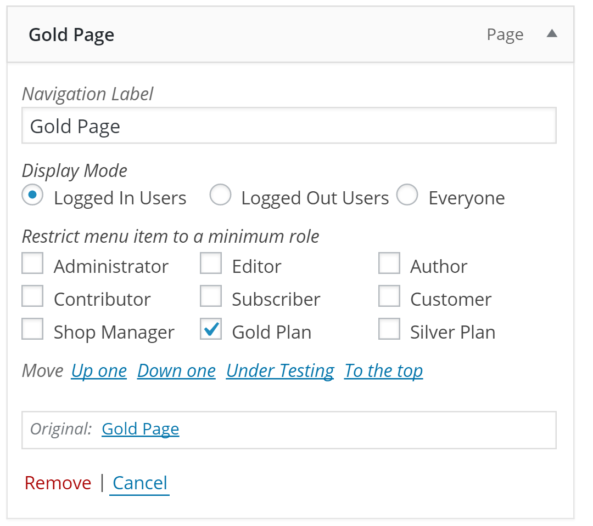

# Nav Menu Roles + WooCommerce Memberships  

A bridge plugin that adds WooCommerce Membership Plans to Nav Menu Roles menu options. 

## Requirements
1. [Nav Menu Roles](https://wordpress.org/plugins/nav-menu-roles/)
2. [WooCommerce Memberships](https://woocommerce.com/products/woocommerce-memberships/)
3. Nav Menu Roles + WooCommerce Memberships

All three plugins must be installed, and activated in order to get the desired result. 

## Usage

1. Go to Appearance > Menus
1. Set the "Display Mode" to "Logged In Users"
1. Under "Restrict menu item to a minimum role" you will now see all your WooCommerce Memberships
1. Check the boxes next to the desired memberships

## Donate 

If you are using this plugin to help make you money, why not [send me a cocktail](https://www.paypal.me/helgatheviking)?

